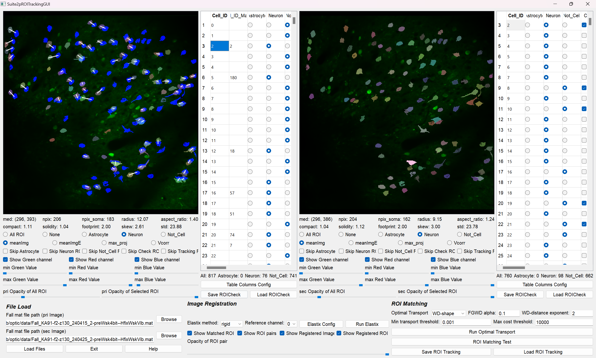
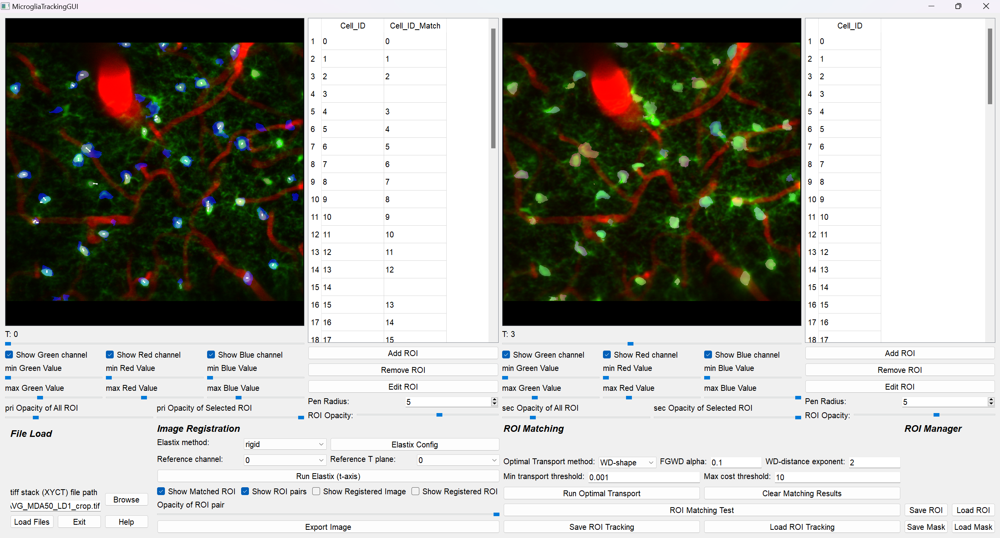
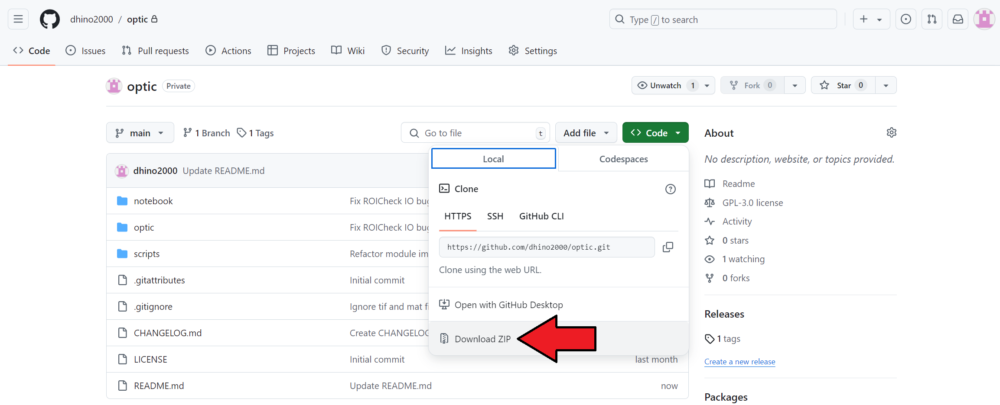

# OPTIC
## OPTIC(OPtimized Toolbox for Image-based Cellular analysis)

OPTIC consists of four specialized applications:
### 1. Suite2pROICheck


#### Input Format
- Fall.mat: Suite2p output file containing ROI information  
- Reference tiff image (optional)  
- Event npy file (optional): for stimulus timing analysis  
#### Features
- Efficient ROI classification (Neurons, Noise, etc.)
- Supports multiple cell types (Astrocytes, Microglia)
- Event-aligned trace analysis
- Real-time ROI selection with trace visualization

### 2. Suite2pROITracking


#### Input Format
- Two Fall.mat files from different imaging sessions
#### Features
- Manual ROI tracking between sessions
- Automated tracking assistance:
  - Image registration (Elastix)
  - Optimal transport algorithms
- Visualization of matched ROI pairs

### 3. MicrogliaTracking


#### Input Format
- TIFF stack (dimensions: XYCT)  
X, Y: spatial dimensions  
C: channels for multichannel imaging  
T: time points for time-lapse imaging  
#### Features
- CellPose integration for Microglia ROI detection
- Time-series ROI tracking
- Migration distance calculation
- Path trajectory analysis

### 4. TIFStackExplorer


#### Input Format
- TIFF stack (dimensions: XYCZT)  
X, Y: spatial dimensions  
C: channels (1-3)  
Z: z-planes  
T: time points
#### Features
- Multi-channel visualization
- Z-stack navigation
- Time series playback
- ROI-based analysis
- Image registration across time points or z-planes

## Installation

### Requirements
- OS: Windows 11
- Python: 3.8.19
- CPU: > 24 cores
- RAM: > 128 GB

### Installation
1. Install [Anaconda](https://www.anaconda.com/download/success)

- Install Anaconda distribution and prepare Python environment

2. Install optic package



- Click on the "Download ZIP" button and extract the contents of the downloaded file
- Move the extracted folder to the appropriate directory.

(ex) "C:/Users/dhino2000/optic"

3. Environment settings

- open "Anaconda Prompt" and move to OPTIC directory
- create OPTIC environment with `conda env create -f optic.yml`

## How to use
### Suite2pROICheck
1. Open the Anaconda Prompt and switch to the desired environment.  
`activate optic`
  
2. Execute the "suite2p_roi_check.py" script

(ex) `python C:/Users/dhino2000/optic/scripts/suite2p_roi_check.py`

3. Sort and Check ROIs!
([Suite2pROICheck Tutorial](https://github.com/dhino2000/optic/blob/main/docs/Suite2pROICheck/tutorial.md))

### Suite2pROITracking
1. Open the Anaconda Prompt and switch to the desired environment.  
`activate optic`
  
2. Execute the "suite2p_roi_tracking.py" script  

(ex) `python C:/Users/dhino2000/optic/scripts/suite2p_roi_tracking.py`

3. Track ROIs!
([Suite2pROITracking Tutorial](https://github.com/dhino2000/optic/blob/main/docs/Suite2pROITracking/tutorial.md))

### MicrogliaTracking
1. Open the Anaconda Prompt and switch to the desired environment.  
`activate optic`
  
2. Execute the "microglia_tracking.py" script  

(ex) `python C:/Users/dhino2000/optic/scripts/microglia_tracking.py`

3. Track ROIs!
([MicrogliaTracking Tutorial](https://github.com/dhino2000/optic/blob/main/docs/MicrogliaTracking/tutorial.md))

### TIFStackExplorer
1. Open the Anaconda Prompt and switch to the desired environment.  
`activate optic`
  
2. Execute the "tif_stack_explorer.py" script  

(ex) `python C:/Users/dhino2000/optic/scripts/tif_stack_explorer.py`

3. 
([TIFStackExplorer Tutorial](https://github.com/dhino2000/optic/blob/main/docs/TIFStackExplorer/tutorial.md))

## Downstream Analysis  
After analyzing with these applications, some downstream analyses may be required. For guidance on these analyses, please refer to the Jupyter notebooks beginning with **"Chapter"** in the [notebook folder](https://github.com/dhino2000/optic/tree/main/notebook). These notebooks provide step-by-step examples and instructions for some downstream analysis workflows.

## Dependencies and External Libraries

This project includes the following external libraries:

### Suite2p

- Original Repository: https://github.com/MouseLand/suite2p

```bibtex
@article {Pachitariu061507,
	author = {Pachitariu, Marius and Stringer, Carsen and Dipoppa, Mario and Schr{\"o}der, Sylvia and Rossi, L. Federico and Dalgleish, Henry and Carandini, Matteo and Harris, Kenneth D.},
	title = {Suite2p: beyond 10,000 neurons with standard two-photon microscopy},
	elocation-id = {061507},
	year = {2017},
	doi = {10.1101/061507},
	publisher = {Cold Spring Harbor Laboratory},
	abstract = {Two-photon microscopy of calcium-dependent sensors has enabled unprecedented recordings from vast populations of neurons. While the sensors and microscopes have matured over several generations of development, computational methods to process the resulting movies remain inefficient and can give results that are hard to interpret. Here we introduce Suite2p: a fast, accurate and complete pipeline that registers raw movies, detects active cells, extracts their calcium traces and infers their spike times. Suite2p runs on standard workstations, operates faster than real time, and recovers ~2 times more cells than the previous state-of-the-art method. Its low computational load allows routine detection of ~10,000 cells simultaneously with standard two-photon resonant-scanning microscopes. Recordings at this scale promise to reveal the fine structure of activity in large populations of neurons or large populations of subcellular structures such as synaptic boutons.},
	URL = {https://www.biorxiv.org/content/early/2017/07/20/061507},
	eprint = {https://www.biorxiv.org/content/early/2017/07/20/061507.full.pdf},
	journal = {bioRxiv}
}
```

### Cellpose

- Original Repository: https://github.com/MouseLand/cellpose

```bibtex
@article {Stringer2024.02.10.579780,
	author = {Stringer, Carsen and Pachitariu, Marius},
	title = {Cellpose3: one-click image restoration for improved cellular segmentation},
	elocation-id = {2024.02.10.579780},
	year = {2024},
	doi = {10.1101/2024.02.10.579780},
	publisher = {Cold Spring Harbor Laboratory},
	abstract = {Generalist methods for cellular segmentation have good out-of-the-box performance on a variety of image types. However, existing methods struggle for images that are degraded by noise, blurred or undersampled, all of which are common in microscopy. We focused the development of Cellpose3 on addressing these cases, and here we demonstrate substantial out-of-the-box gains in segmentation and image quality for noisy, blurry or undersampled images. Unlike previous approaches, which train models to restore pixel values, we trained Cellpose3 to output images that are well-segmented by a generalist segmentation model, while maintaining perceptual similarity to the target images. Furthermore, we trained the restoration models on a large, varied collection of datasets, thus ensuring good generalization to user images. We provide these tools as {\textquotedblleft}one-click{\textquotedblright} buttons inside the graphical interface of Cellpose as well as in the Cellpose API.Competing Interest StatementThe authors have declared no competing interest.},
	URL = {https://www.biorxiv.org/content/early/2024/02/25/2024.02.10.579780},
	eprint = {https://www.biorxiv.org/content/early/2024/02/25/2024.02.10.579780.full.pdf},
	journal = {bioRxiv}
}
```

### ITKElastix

- Original Repository: https://github.com/InsightSoftwareConsortium/ITKElastix

### POT (Python Optimal Transport)

- Original Repository: https://github.com/PythonOT/POT

```bibtex
@article{flamary2021pot,
  author  = {R{\'e}mi Flamary and Nicolas Courty and Alexandre Gramfort and Mokhtar Z. Alaya and Aur{\'e}lie Boisbunon and Stanislas Chambon and Laetitia Chapel and Adrien Corenflos and Kilian Fatras and Nemo Fournier and L{\'e}o Gautheron and Nathalie T.H. Gayraud and Hicham Janati and Alain Rakotomamonjy and Ievgen Redko and Antoine Rolet and Antony Schutz and Vivien Seguy and Danica J. Sutherland and Romain Tavenard and Alexander Tong and Titouan Vayer},
  title   = {POT: Python Optimal Transport},
  journal = {Journal of Machine Learning Research},
  year    = {2021},
  volume  = {22},
  number  = {78},
  pages   = {1-8},
  url     = {http://jmlr.org/papers/v22/20-451.html}
}
```

### FGW (Fused Gromov-Wasserstein)

- Original Repository: https://github.com/tvayer/FGW

```bibtex
@InProceedings{vay2019fgw,
  title      =    {Optimal Transport for structured data with application on graphs},
  author     =    {Titouan, Vayer and Courty, Nicolas and Tavenard, Romain and Laetitia, Chapel and Flamary, R{\'e}mi},
  booktitle  =    {Proceedings of the 36th International Conference on Machine Learning},
  pages      =    {6275--6284},
  year       =    {2019},
  editor     =    {Chaudhuri, Kamalika and Salakhutdinov, Ruslan},
  volume     =    {97},
  series     =    {Proceedings of Machine Learning Research},
  address    =    {Long Beach, California, USA},
  month      =    {09--15 Jun},
  publisher  =    {PMLR},
  pdf        =    {http://proceedings.mlr.press/v97/titouan19a/titouan19a.pdf},
  url        =    {http://proceedings.mlr.press/v97/titouan19a.html}
}
```

## References
[1] Marius Pachitariu, Carsen Stringer, Mario Dipoppa, Sylvia Schröder, L. Federico Rossi, Henry Dalgleish, Matteo Carandini, Kenneth D. Harris. "Suite2p: beyond 10,000 neurons with standard two-photon microscopy", bioRxiv, 2016.

[2] Stringer, C., Wang, T., Michaelos, M., & Pachitariu, M. (2021). Cellpose: a generalist algorithm for cellular segmentation. Nature methods, 18(1), 100-106.

[3] Pachitariu, M. & Stringer, C. (2022). Cellpose 2.0: how to train your own model. Nature methods, 1-8.

[4] Stringer, C. & Pachitariu, M. (2024). Cellpose3: one-click image restoration for improved segmentation. bioRxiv.

[5] S. Klein, M. Staring, K. Murphy, M.A. Viergever, J.P.W. Pluim, "elastix: a toolbox for intensity based medical image registration", IEEE Transactions on Medical Imaging, vol. 29, no. 1, pp. 196 - 205, January 2010.

[6] D.P. Shamonin, E.E. Bron, B.P.F. Lelieveldt, M. Smits, S. Klein and M. Staring, "Fast Parallel Image Registration on CPU and GPU for Diagnostic Classification of Alzheimer's Disease", Frontiers in Neuroinformatics, vol. 7, no. 50, pp. 1-15, January 2014.

[7] Kasper Marstal, Floris Berendsen, Marius Staring and Stefajkn Klein, "SimpleElastix: A user-friendly, multi-lingual library for medical image registration", International Workshop on Biomedical Image Registration (WBIR), Las Vegas, Nevada, USA, 2016.

[8] K. Ntatsis, N. Dekker, V. Valk, T. Birdsong, D. Zukić, S. Klein, M Staring, M McCormick, "itk-elastix: Medical image registration in Python", Proceedings of the 22nd Python in Science Conference, pp. 101 - 105, 2023, https://doi.org/10.25080/gerudo-f2bc6f59-00d.

[9] Rémi Flamary, Nicolas Courty, Alexandre Gramfort, Mokhtar Z. Alaya, Aurélie Boisbunon, Stanislas Chambon, Laetitia Chapel, Adrien Corenflos, Kilian Fatras, Nemo Fournier, Léo Gautheron, Nathalie T.H. Gayraud, Hicham Janati, Alain Rakotomamonjy, Ievgen Redko, Antoine Rolet, Antony Schutz, Vivien Seguy, Danica J. Sutherland, Romain Tavenard, Alexander Tong, Titouan Vayer, POT Python Optimal Transport library, Journal of Machine Learning Research, 22(78):1−8, 2021.

[9] Titouan Vayer, Laetitia Chapel, Rémi Flamary, Romain Tavenard, Nicolas Courty, Optimal Transport for structured data with application on graphs, Proceedings of the 36th International Conference on Machine Learning, pp.6275-6284, PMLR 97, 2019.


