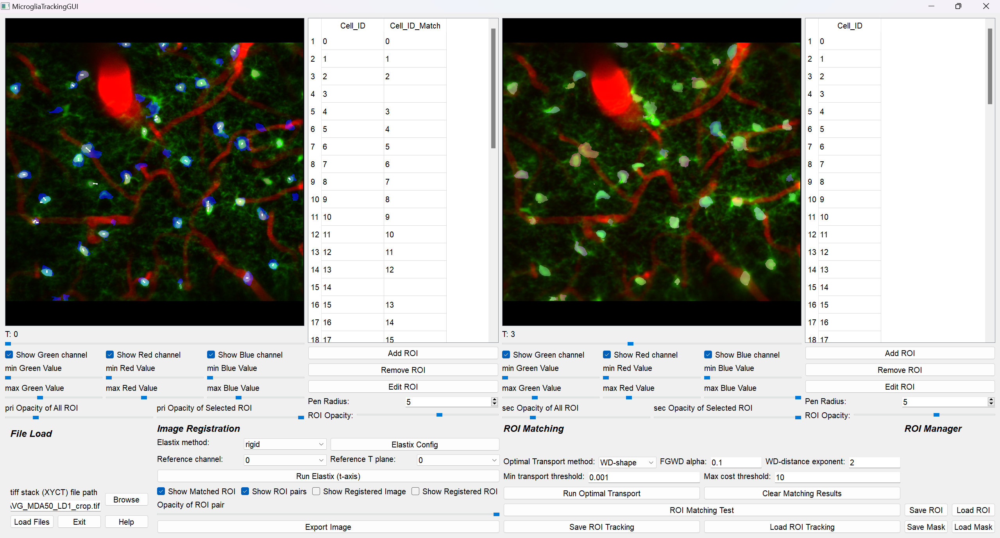
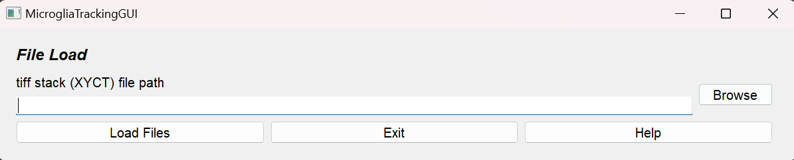
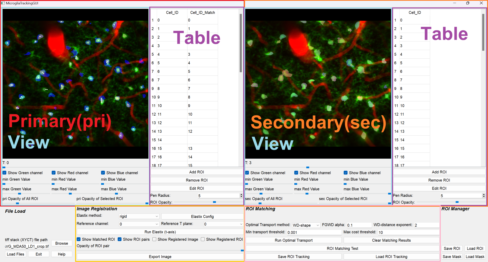
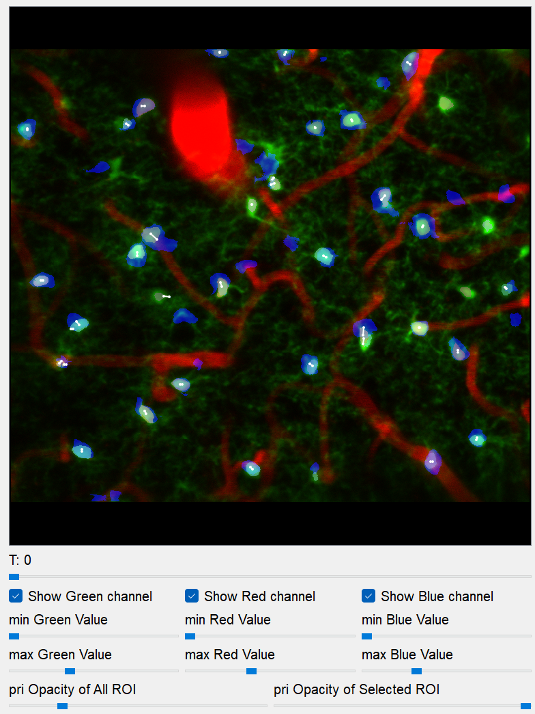
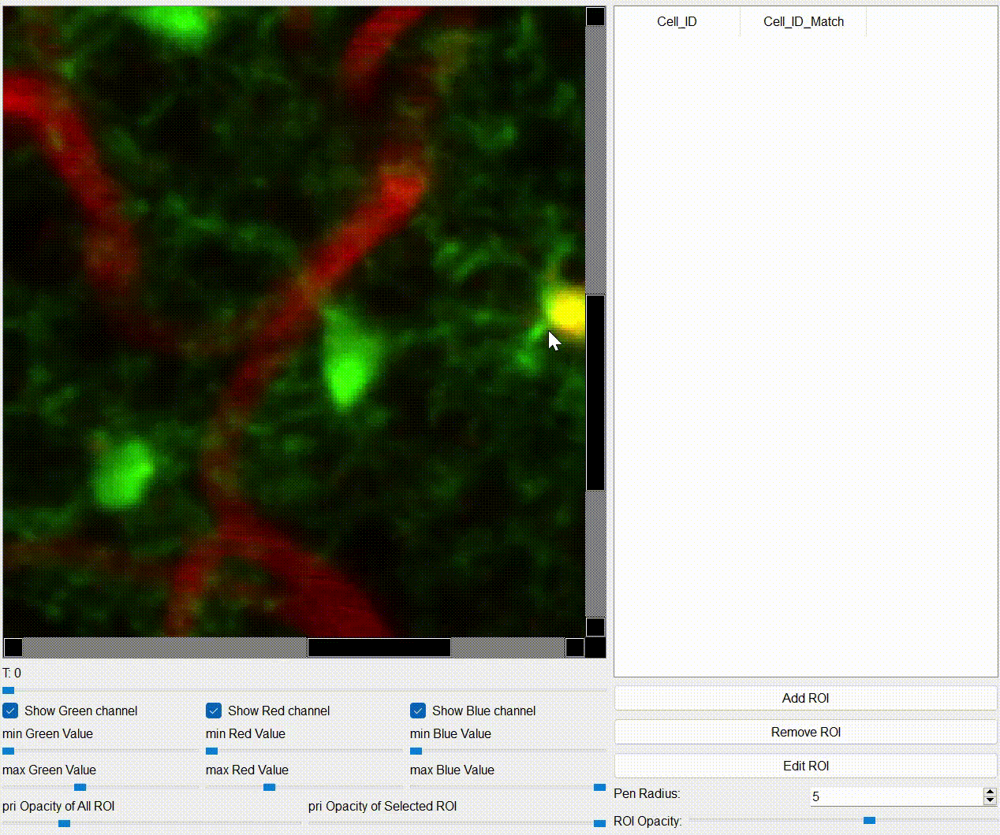
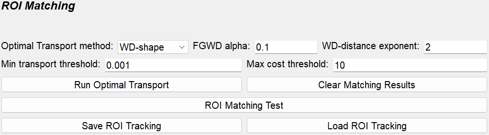

MicrogliaTracking Tutorial
==========================

**Microglia Tracking** is a specialized tool developed for detecting microglial ROIs from XYCT image stacks and analyzing their dynamics through time-series tracking. This tool implements **Cellpose** for high-precision ROI detection and offers seamless integration with **ImageJ**, enabling comprehensive downstream analyses of microglial dynamics.

Workflow
--------

1. **Load Microglia XYCT stack tif file**
2. **Image registration** (see :ref:`image-registration`)
3. **Draw ROIs, Extract ROIs with Cellpose** (see :ref:`view-section`)
4. **Auto ROI tracking** (see :ref:`automatic-roi-matching`)
5. **Check ROI tracking manually**
6. **Save MicrogliaTracking.mat file**

Input
-----

The input tif stack file format should be **XYCT**, and the number of channels must be less than 3. If you have an XYZCT tif stack, please convert it to XYCT with z-axis projection.

- **(Required):** XYCT tif stack

Output
------

The result of ROI tracking is exported as **MicrogliaTracking~.mat**:

- **MicrogliaTracking_{name_of_the_tif_file}.mat**

Load Fall.mat file
------------------

**tiff stack (XYCT) file path (Required):**

   Push the "browse" button and choose the microglia tif file. The file must contain 2 or more frames.

Application Interface
---------------------

**MicrogliaTracking** consists of two major sections, **primary (pri)** and **secondary (sec)**, each containing two sub-sections: **View** and **Table**. The primary and secondary sections have different functionalities and display distinct content.

View Section
------------

**View**

Displays ROIs from the table with the selected ROI highlighted.  
If **Match_Cell_ID** is filled, a white line is drawn between the primary **Cell_ID** ROI and the secondary **Match_Cell_ID** ROI.  
The opacity of the white line can be adjusted with the **Opacity of ROI pair** slider.  

**Key operations:**

- **Left mouse click:** Choose the closest ROI.
- **Right mouse click (only in pri view):** Choose the closest ROI from the secondary view.
- **Ctrl + mouse wheel:** Zoom in/out.
- **Middle mouse drag:** Pan.
- **R:** Reset view zoom.

**T slider:** Switch time point (the primary time point is always earlier than the secondary).  

**Image Contrast:**

- **Green:** Background image contrast of primary channel (e.g. microglia).
- **Red:** Background image contrast of secondary channel (e.g. vessel).
- **Blue:** Secondary ROIs.

**ROI Opacity:** Adjust the opacity of all and the selected ROI via sliders.

**ROI edit mode**

ROIs can be added, removed, and edited.

- **Add ROI:** Draw a new ROI with mouse drag and register it by pressing the space key.  
- **Remove ROI:** Remove the selected ROI.  
- **Edit ROI:** Edit the selected ROI.  
- **Pen Radius:** Adjust the pen size.  
- **ROI Opacity:** Adjust the opacity of the ROI being edited.  
- **Key operations:**

  - **Left mouse drag:** Draw ROI.  
  - **Right mouse drag:** Erase ROI.  
  - **Space key:** Exit ROI edit mode.  

Automatic ROI Extraction with Cellpose
----------------------------------------

**Automatic ROI Extraction with Cellpose:**
- Placeholder: "c"
- (No image provided)

Table Section
-------------

**Cell_ID:**
- The table is initially empty when the TIFF stack is loaded.
- Cell_IDs are added either by manually drawing ROIs using "Add ROI" or by loading the **seg.npy** file generated by Cellpose.
- ROIs are stored for each time plane, and the table content updates accordingly when the T slider is adjusted.
- (No image provided)

**Cell_ID_Match:**
- The primary table includes an additional column, **Cell_ID_Match**, which shows the secondary ROI ID matched to the primary ROI.
- Initially blank; when a number is filled, a white line is drawn in the View indicating the match.
- The number must be an integer between 0 and the maximum ROI number in the secondary data.
- When an ROI is removed using "Remove ROI", its corresponding **Cell_ID_Match** is also removed.

**One-to-one ROI matching:**
- Matching should be one-to-one.
- Avoid one primary ROI matching multiple secondary ROIs, or vice versa.

Image Registration
------------------

.. _image-registration:

**Image Registration:**
- Supports manual ROI matching.
- Due to image drifting noise, ROI matching can be challenging.
- This section uses `ITKElastix <https://github.com/InsightSoftwareConsortium/ITKElastix>`_ to register the secondary (moving) image to the primary (fixed) image based on the background image.
- The resulting transformation is applied to the ROIs, enabling efficient overlay of primary and secondary ROIs.
- The application supports three types of image transformation: **Rigid**, **Affine**, and **B-Spline**.

**Performance Comparison:**

+--------------------------------------+------------------------+------------------------+------------------------+
|                                      | **Rigid**              | **Affine**             | **B-Spline**           |
+======================================+========================+========================+========================+
| **Computation Speed**                | 0.5 ~ 1 sec/image      | 1 ~ 2 sec/image        | 2 ~ 4 sec/image        |
+--------------------------------------+------------------------+------------------------+------------------------+
| **Degrees of Freedom**               | Moderate               | Good                   | Excellent              |
+--------------------------------------+------------------------+------------------------+------------------------+
| **Shape Preservation**               | Excellent              | Good                   | Moderate               |
+--------------------------------------+------------------------+------------------------+------------------------+
| **Robustness**                       | Good                   | Good                   | Good                   |
+--------------------------------------+------------------------+------------------------+------------------------+
| **Local Deformation Handling**       | Poor                   | Poor                   | Excellent              |
+--------------------------------------+------------------------+------------------------+------------------------+
| **Motion Correction**                | Poor                   | Moderate               | Excellent              |
+--------------------------------------+------------------------+------------------------+------------------------+
| **Registration Accuracy**            | Moderate               | Good                   | Excellent              |
+--------------------------------------+------------------------+------------------------+------------------------+

- First, set the **Elastix method** and then the **reference channel** (if the stack is from single-channel imaging, leave it as is).
- The Elastix configuration can be customized using **Elastix Config**.
- Click **Run Elastix** and wait until registration is complete. You can monitor progress on the Anaconda Prompt.

- **Elastix Image Registration Config Window:**

.. image:: _static/images/microglia_tracking/suite2p_roi_tracking_elastix_config.png
   :alt: Elastix Config Window

Automatic ROI Matching
----------------------

.. _automatic-roi-matching:

**Automatic ROI Matching:**
- Automatic ROI matching is available to reduce manual effort.
- Often, the number of ROI pairs exceeds 100, making manual matching time-consuming.
- Combining automatic matching with manual corrections yields highly efficient and accurate ROI tracking.
- Typical workflow:
  1. Perform ROI classification with Suite2pROICheck.
  2. Apply automatic ROI matching for specific cell types.
  3. Manually adjust matches to ensure accuracy.
  4. Utilize image registration support when necessary.
- **Parameters for Optimal Transport:**
  - **Loss:** Options include **OT (Optimal Transport)**, **OT_partial**, **OT_entropic**, and
    **OT_lagrange**. 
  - **Pruning ROI Matching:** A two-step process:
    1. **Minimum transport value pruning:** Eliminates ROI pairs with a transport value below a threshold ("Min transport threshold").
    2. **Maximum transport cost pruning:** If the transport cost exceeds a threshold ("Max cost threshold"), the primary ROI is considered unmatched.
- **ROI Matching Test Window:**
  - Provides a visual preview of optimal transport patterns between primary and secondary ROIs.
  - **Red dots:** Centers of primary ROIs.
  - **Blue dots:** Centers of secondary ROIs.
  - **Green lines:** Indicate ROI matching between primary and secondary.
  - The transport plan is represented as a (source samples) × (destination samples) matrix; the initial matching is multi-to-multi. Users can enable the "Plot Transport Plan" option to view the complete matrix before pruning.
- **Save/Load ROI Tracking Result:**
  - The ROI matching results are saved as **ROITracking.mat** files, each containing tracking data between two imaging sessions.
  - For tracking across three or more sessions, create separate ROITracking files for each session pair.
  - For downstream analysis using these tracking results, please refer to the provided `Jupyter notebooks <https://github.com/dhino2000/optic>`_.

- **ROI Matching Test Window:**

.. image:: _static/images/microglia_tracking/suite2p_roi_tracking_roi_matching_test.png
   :alt: ROI Matching Test Window

ROI Manager
-----------

**ROI Manager:**
- **Save/Load ROI:** Save or load ROI data.
- **Save/Load Mask:** The exported mask file from Cellpose, ``seg.npy``, can be loaded and exported. The mask file must be generated using **Zstack mode**.
