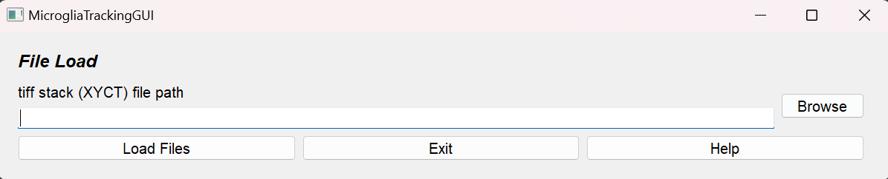
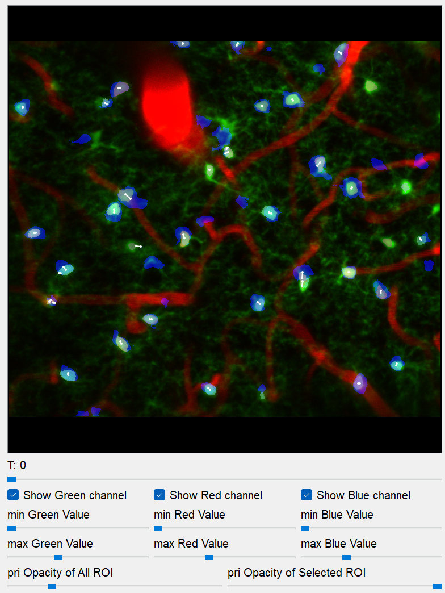
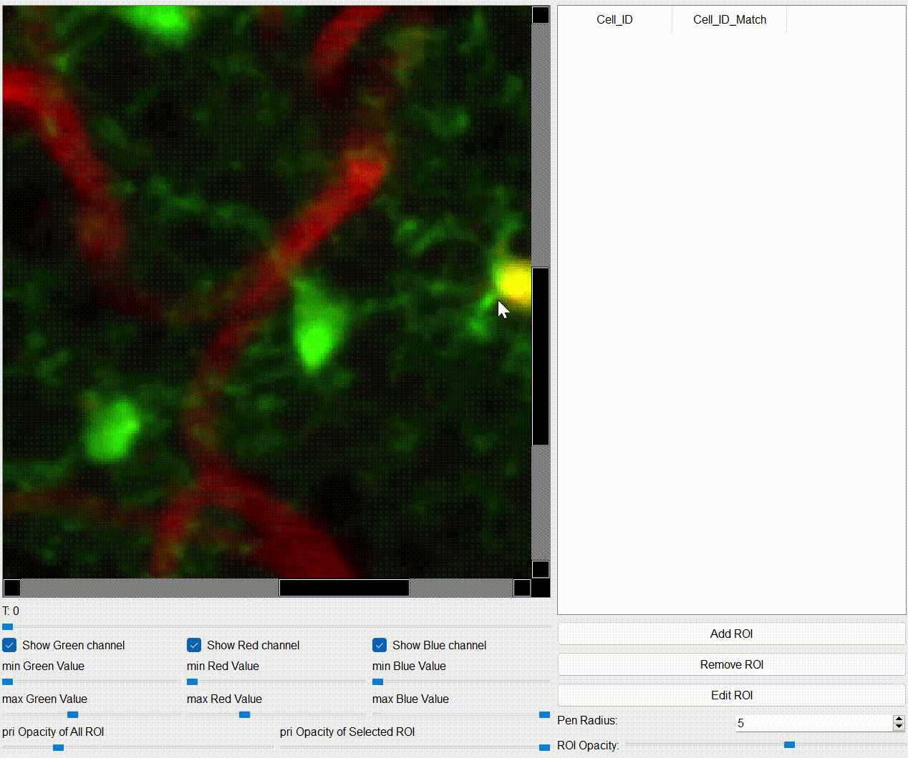
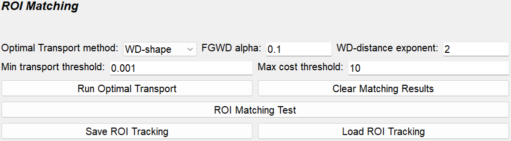

# MicrogliaTracking Tutorial

**Microglia Tracking** is a specialized tool developed for detecting microglial ROIs from XYCT image stacks and analyzing their dynamics through time-series tracking. 
This tool implements **Cellpose** for high-precision ROI detection and offers seamless integration with **ImageJ**, enabling comprehensive downstream analyses of microglial dynamics.

## Workflow

1. **Load Microglia XYCT stack tif file**
2. [**Image registration**](#image-registration)
3. [**Draw ROIs, Extract ROIs with Cellpose**](#view-section)
4. [**Auto ROI tracking**](#automatic-roi-matching)
5. **Check ROI tracking manually**
6. **Save MicrogliaTracking.mat file**

## Input
The input tif stack file format should be **XYCT**, and the number of channel have to be less than 3. If you have XYZCT tif stack, please convert to XYCT with z-axis projection.  
- (Required): **XYCT tif stack** 

## Output
The result of ROI tracking is exported as **MicrogliaTracking~.mat**
- **MicrogliaTracking_{name_of_the_tif_file}.mat**

## Load Fall.mat file

**tiff stack (XYCT) file path (Required):**   

push "browse" button and choose microglia tif file. The number of the file's frame must be 2 or more. 

## Application interface

**MicrogliaTracking** consists of two major sections, **primary (pri)** and **secondary (sec)**, and each section consists of two minor sections, **View** and **Table**. 
The primary (pri) and secondary (sec) sections have different functionalities and display distinct content.    

### View Section
<table>
<tr>
<td width="50%">

- **View**
  
  display ROIs of the table and the choosed ROI is highlighted. If **Macth_Cell_ID** is filled, white line between pri **Cell_ID** ROI and sec **Macth_Cell_ID** ROI is drawn. The opacity of white line can be changed with **Opacity of ROI pair** slider.    
  - **Left mouse click** : Choose the closest ROI
  - **Right mouse click** (only pri view) : Choose the closest ROI of sec view
  - **ctrl + mouse wheel** : Zoom in/out
  - **Middle mouse drag** : Pan
  - **R** : Reset view zoom

- **T slider**
  Switch time point. The time point of the pri is always earlier than that of sec.
  
- **Image Contrast**
  
  - **Green** : Background image contrast of primary channel. (ex): microglia  
  - **Red** : Background image contrast of seconday channel. (ex): vessel  
  - **Blue** : Secondary ROIs.     

- **ROI Opacity**  
  Opacity of all and the selected ROI can be changed with the sliders.

-----------------------------------------------------------------------------------

- **ROI edit mode**  
  ROIs can be added, removed, and edited.  
  - **Add ROI**: Add a new ROI. You can draw the ROI on the View with **mouse drag**, and register it as a new ROI with press the **space key**.  
  - **Remove ROI**: Remove the selected ROI.
  - **Edit ROI**: Edit the selected ROI.  
  - **Pen Radius**: Adjust the pen size.  
  - **ROI Opacity**: Opacity of the ROI being edited.  
 
  - **Key operation**
    - **Left mouse drag**: Draw ROI
    - **Right mouse drag**: Erase ROI
    - **Space key**: Exit ROI edit mode  

</td>
<td width="50%">

-----------------------------------------------------------------------------------

</td>
</tr>
</table>

### Automatic ROI Extraction with Cellpose
<table>
<tr>
<td width="50%">

c

</td>
<td width="50%">

</td>
</tr>
</table>

### Table Section
<table>
<tr>
<td width="50%">

- **Cell_ID**
  The table is initially empty when the TIFF stack is loaded. Cell_ID is added either by using the "Add ROI" to manually draw ROIs or by loading the **seg.npy** file generated by Cellpose.
The ROIs are stored for each t plane, and the content of the table updates accordingly when the T slider is adjusted.
  
- **Cell_ID_Match**
  
  **Pri** table has additionaly column, **Cell_ID_Match**, the secondary ROI ID matched to the primary ROI ID.   

  Cell_ID_Match is initially blank, but when a number is filled, a white line is drawn on the **View**.
  This indicates which **sec** ROI matches to the **pri** ROI.
  This number must be a integer value between 0 and the maximum ROI number in sec.
  When the ROI is removed with "Remove ROI", all **Cell_ID_Match** of the ROI are also removed.

- **one-to-one ROI matching**
  
  Also, the matching should basically be **one-to-one**, and you should avoid having one pri ROI matches to multiple sec ROIs, or vice versa.

</td>
<td width="50%">
  

</td>
</tr>
</table>

### Image Registration
<table>
<tr>
<td width="50%">

**Image registration** supports **manual** ROI matching. 
While the ROI arrangement pattern is basically similar between the sessions from the same subject, image drifting noise makes ROI matching process difficult. 
In this section, image registration using [**ITKElastix**](https://github.com/InsightSoftwareConsortium/ITKElastix) is available. 
It performs registration from **sec (moving)** to **pri (fixed)** based on the background image, and applies the obtained transformation to the ROIs as well, enabling more efficient ROI matching by overlaying pri ROIs and sec ROIs.

This application has three types of image transformation, **Rigid**, **Affine**, and **B-Spline**.  
- **Performance comparison of image transformations**
<table>
  <tr>
    <td></td>
    <td> <b>Rigid </td>
    <td> <b>Affine </td>
    <td> <b>B-Spline </td>
  </tr>
  <tr>
    <td> <b>Computation Speed </td>
    <td> 0.5 ~ 1 (sec/image) </td>
    <td> 1 ~ 2 (sec/image) </td>
    <td> 2 ~ 4 (sec/image) </td>
  </tr>
  <tr>
    <td> <b>Degrees of Freedom </td>
    <td> Moderate </td>
    <td> Good </td>
    <td> Excellent </td>
  </tr>
  <tr>
    <td> <b>Shape Preservation </td>
    <td> Excellent </td>
    <td> Good </td>
    <td> Moderate </td>
  </tr>
  <tr>
    <td> <b>Robustness </td>
    <td> Good </td>
    <td> Good </td>
    <td> Good </td>
  </tr>
  <tr>
    <td> <b>Local Deformation Handling </td>
    <td> Poor </td>
    <td> Poor </td>
    <td> Excellent </td>
  </tr>
  <tr>
    <td> <b>Motion Correction </td>
    <td> Poor </td>
    <td> Moderate </td>
    <td> Excellent </td>
  </tr>
  <tr>
    <td> <b>Registration Accuracy </td>
    <td> Moderate </td>
    <td> Good </td>
    <td> Excellent </td>
  </tr>
</table>

First, set the **Elastix method**, and then set the **reference channel** (if the Fall is extracted from single-channel imaging, leave it as is). 
The configuration for the Elastix transformation method can be customized with **Elastix Config**. 
Click **Run Elastix** and wait for a while until the image registration is complete. 
You can monitor the progress on Anaconda Prompt.

</td>
<td width="50%">
  

- **Elastix Image Registration Config Window**

</td>
</tr>
</table>

### Automatic ROI Matching
<table>
<tr>
<td width="50%">

Automatic ROI matching is also available. 
The number of ROI pairs with ROI matching often exceeds 100, manual ROI matching is time-consuming and labor-intensive even with the assistance of image registration. 
This automatic ROI matching function can significantly reduce the time and effort. 
Furthermore, combining it with manual corrections enables highly efficient and accurate ROI tracking.   
This section provides the tutorial of automatic ROI matching with [optimal transport](https://github.com/PythonOT/POT). 
The typical ROI tracking workflow involves first performing ROI classification with [Suite2pROICheck](https://github.com/dhino2000/optic/edit/main/docs/Suite2pROICheck/tutorial.md), then applying automatic ROI matching for specific cell types, and finally making manual adjustments to ensure matching accuracy. 
Image registration support can be utilized when necessary to improve the matching results.

- **Parameters for Optimal Transport**
  - **Loss**
    
    This application has four optimal transport loss function options: **WD(Wasserstein Distance)-shape**, **WD-distance**, **GWD(Gromov-Wasserstein Distance)**, and [**FGWD(Fused Gromov-Wasserstein Distance)**](https://github.com/tvayer/FGW/tree/master). The WD-distance exponent controls the distance weighting during matching; higher values discourage long-distance matching by penalizing distant pairs more heavily.
    The FGWD alpha parameter balances ROI shape similarity and distance penalty of matching; lower values prioritize distance penalty.
  - **pruning ROI matching**
    
    While optimal transport initially makes multi-to-multi ROIs matching, the algorithm applies a two-step pruning process to derive one-to-one ROI matching suitable for ROI tracking.
    First, **minimum transport value pruning algorithm** eliminates ROI pairs where the transport value is less than the threshold, **"Min transport threshold"**.
    Then, from the remaining pairs, the ROI pair with the highest transport value is choosed.
    Subsequently, through **maximum transport cost pruning algorithm**, if the transport cost of the pair exceeds **"Max cost threshold"**, the pri ROI is considered to not have matched ROI of sec.

- **ROI Matching Test Window**
  
  The **ROI Matching Test** provides a visual preview of optmial transport patterns between pri and sec ROIs.  
  - **Red dots** : the centers of pri ROIs  
  - **Blue dots** : the centers of sec ROIs  
  - **Green lines** : ROI matching between pri and sec.
    
  The transport plan with optimal transport is represented as a (source samples) × (destination samples) matrix, therefore the initial optimal transport result is exported as multi-to-multi ROI matching.
  Users can enable the "Plot Transport Plan" option to visualize this complete transport matrix before pruning.

- **Save, Load ROI Tracking result**
  
  The ROI matching results are saved as **ROITracking.mat** files, each file contains tracking data between two imaging sessions.
  For tracking across three or more sessions, you need to create ROITracking files for each session pair.
  For downstream analysis using these tracking results, please refer to the provided [Jupyter notebooks](https://github.com/dhino2000/optic).

</td>
<td width="50%">
  

- **ROI Matching Test Window**

</td>
</tr>
</table>

### ROI Manager
<table>
<tr>
<td width="50%">

- **Save/Load ROI**

- **Save/Load Mask**
  The exported mask file from Cellpose, seg.npy can be loaded and exported.
  The cellpose mask file have to be generated with **Zstack mode**.

</td>
<td width="50%">

</td>
</tr>
