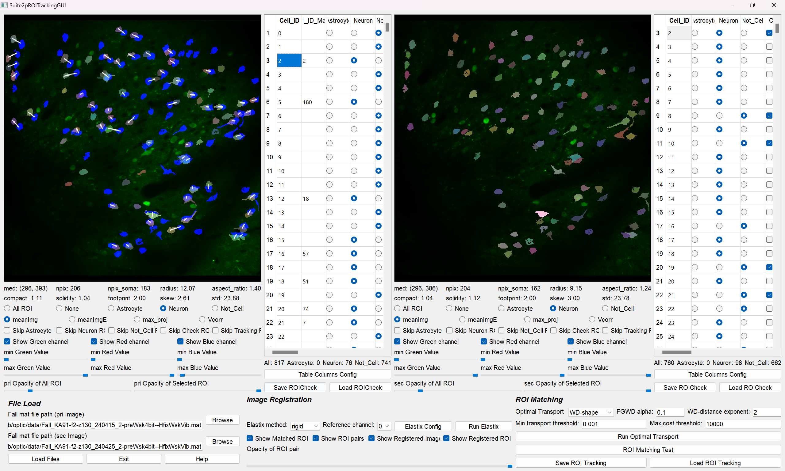
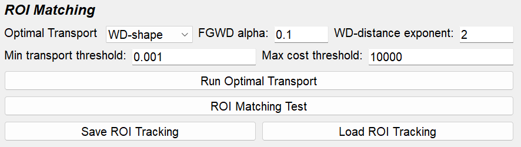

Suite2pROITracking Tutorial
============================

**Suite2pROITracking** is an application developed for efficiently tracking ROIs between different imaging sessions of the same subject. These ROI correspondence relationships are saved as ``.mat`` files to facilitate downstream analysis. Since this application depends on analysis results from
`Suite2pROICheck <https://github.com/dhino2000/optic/edit/main/docs/Suite2pROICheck/tutorial.md>`_,
it is recommended to first perform ROI check.

Workflow
--------

1. **Load Fall.mat**
2. **Load ROICheck.mat**
3. **Image registration** (see :ref:`image-registration`)
4. **Auto ROI tracking** (see :ref:`automatic-roi-matching`)
5. **Check ROI tracking manually**
6. **Save ROITracking.mat file**

Input
-----

Before using this application, please prepare **Fall.mat** and **ROICheck.mat** (the result of ROI check).

- **(Required):** Two Fall.mat files and two ROICheck.mat files

Output
------

The result of ROI tracking is exported as **ROITracking~.mat**:

- **ROITracking_{name_of_the_primary_Fall_file}.mat**

Load Fall.mat file
------------------

**Fall mat file path (Required):**

   Push the "browse" button and choose the **Fall.mat** file. Suite2pROITracking requires two Fall.mat files — one primary (pri) and one secondary (sec). The primary file serves as the reference for determining which ROIs in the primary correspond to those in the secondary.

Application Interface
---------------------

**Suite2pROITracking** consists of two major sections, **primary (pri)** and **secondary (sec)**, each subdivided into **View** and **Table** sections. The secondary view and table function similarly to those in Suite2pROICheck.

Pri View Section
----------------

- **View**  

Displays ROIs from the Fall.mat file with the selected ROI highlighted.

    - If **Match_Cell_ID** is filled, a white line is drawn between the primary ROI and the corresponding secondary ROI.
    - **Mouse actions:**
    - **Left click:** Choose the closest ROI after applying skip conditions.
    - **Right click (primary view only):** Choose the closest ROI from the secondary view after applying skip conditions.

Additionally, the ROI properties (derived from the 
`Suite2p documentation <https://suite2p.readthedocs.io/en/latest/outputs.html>`_) include:

- **med:** (y,x) center of cell  
- **npix:** Number of pixels in ROI  
- **npix_soma:** Number of pixels in ROI's soma  
- **radius:** Estimated radius from a 2D Gaussian fit to the mask  
- **aspect_ratio:** Ratio between major and minor axes of the 2D Gaussian fit  
- **compact:** How compact the ROI is (1 for a disk; >1 means less compact)  
- **solidity:** Possibly similar to compact  
- **footprint:** Spatial extent of the ROI’s functional signal (using a 1/5 threshold of the max and averaging distances from the center)  
- **skew:** Skewness of the neuropil-corrected fluorescence trace  
- **std:** Standard deviation of the neuropil-corrected fluorescence trace

Other settings in the Pri View Section include:

- **ROI Display Setting:** Options to display all ROIs, none, or only specific cell types.  
- **Background Image Display Setting:** Switch among background images (**meanImg**, **meanImgE**, **max_proj**, **Vcorr**).  
- **Skip ROIs with choosing:** Skip ROIs already sorted (e.g., skip **Neuron** when focusing on **Astrocyte** and **Not_Cell**).  
- **Image Contrast:**  
  - **Green:** Contrast of primary background image.  
  - **Red:** Contrast of secondary background image (if available).  
  - **Blue:** Display of secondary ROIs (only those of the cell type set in the display settings).  
- **ROI Opacity:** Adjust the opacity for all or the selected ROI via sliders.

Pri Table Section
-----------------

- **Cell_ID_Match**  

  - The table includes an additional column **Cell_ID_Match** showing the secondary ROI ID matched to the primary ROI.
  - **WARNING:** Ensure table columns match those in the ROICheck file before loading.
  - Initially blank; when filled, a white line appears in the View indicating the match.
  - The value must be an integer between 0 and the maximum ROI number in the secondary file.
  - Typically, matching is performed for neurons.

- **One-to-one ROI Matching:**  

  Matching should be one-to-one; avoid one primary ROI matching multiple secondary ROIs or vice versa.

Image Registration
------------------

.. _image-registration:

**Image registration** supports manual ROI matching. Due to image drift between sessions, ROI matching can be challenging. This section uses
`ITKElastix <https://github.com/InsightSoftwareConsortium/ITKElastix>`_ to register the secondary (moving) image to the primary (fixed) image based on the background, and applies the transformation to the ROIs, enabling efficient overlay of primary and secondary ROIs.

This application offers three types of image transformations:

- **Rigid**
- **Affine**
- **B-Spline**

**Performance Comparison:**

+--------------------------------------+------------------------+------------------------+------------------------+
|                                      | **Rigid**              | **Affine**             | **B-Spline**           |
+======================================+========================+========================+========================+
| **Computation Speed**                | 0.5 ~ 1 sec/image      | 1 ~ 2 sec/image        | 2 ~ 4 sec/image        |
+--------------------------------------+------------------------+------------------------+------------------------+
| **Degrees of Freedom**               | Moderate               | Good                   | Excellent              |
+--------------------------------------+------------------------+------------------------+------------------------+
| **Shape Preservation**               | Excellent              | Good                   | Moderate               |
+--------------------------------------+------------------------+------------------------+------------------------+
| **Robustness**                       | Good                   | Good                   | Good                   |
+--------------------------------------+------------------------+------------------------+------------------------+
| **Local Deformation Handling**       | Poor                   | Poor                   | Excellent              |
+--------------------------------------+------------------------+------------------------+------------------------+
| **Motion Correction**                | Poor                   | Moderate               | Excellent              |
+--------------------------------------+------------------------+------------------------+------------------------+
| **Registration Accuracy**            | Moderate               | Good                   | Excellent              |
+--------------------------------------+------------------------+------------------------+------------------------+

First, set the **Elastix method** and then the **reference channel** (if the Fall.mat is from single-channel imaging, leave as is). The configuration for the Elastix transformation can be customized using **Elastix Config**. Click **Run Elastix** and wait until registration completes; progress can be monitored in the Anaconda Prompt.

- **Elastix Image Registration Config Window:**

  .. image:: _static/images/suite2p_roi_tracking/suite2p_roi_tracking_elastix_config.png
     :alt: Elastix Config Window

Automatic ROI Matching
----------------------

.. _automatic-roi-matching:

**Automatic ROI Matching** is available to further reduce manual effort. Often, the number of ROI pairs exceeds 100, making manual matching time-consuming even with image registration. Combining automatic matching with manual corrections yields efficient and accurate ROI tracking.

The typical workflow for ROI tracking involves:

1. Performing ROI classification with Suite2pROICheck.
2. Applying automatic ROI matching for specific cell types.
3. Manually adjusting to ensure accurate matching.
4. Optionally, utilizing image registration support to improve results.

**Parameters for Optimal Transport:**

- **Loss:**
  
    Options include **OT (Optimal Transport)**, **OT_partial**, **OT_entropic**, and **OT_lagrange**. 
    For details on these losses, please refer to `Python Optimal Transport <https://pythonot.github.io/index.html>`_.
    The optimal transport method utilizes the distance matrix of ROIs between planes.  

- **Optimal Transport Parameters**
  
   - **Partial OT mass:** Amount of mass to be transported. Set the value between 0 and 1.
   - **Partial OT regularization:** Regularization term for OT_entropic and OT_lagrange. Set the value greater than 0.
   - **OT-distance exponent:** The exponent for the distance matrix.
   - **Minimum transport value pruning:** Eliminates ROI pairs with a transport value below a threshold ("Min transport threshold").
   - **Maximum transport cost pruning:** If the transport cost exceeds a threshold ("Max cost threshold"), the primary ROI is considered unmatched.

**ROI Matching Test Window:**

Provides a visual preview of the optimal transport patterns between primary and secondary ROIs:

- **Red dots:** Centers of primary ROIs.
- **Blue dots:** Centers of secondary ROIs.
- **Green lines:** Indicate ROI matching between primary and secondary.

The transport plan is represented as a matrix (source samples × destination samples); thus, the initial matching is multi-to-multi. Users can enable the "Plot Transport Plan" option to view the complete matrix before pruning.

**Save/Load ROI Tracking Result:**

The ROI matching results are saved as **ROITracking.mat** files, each containing tracking data between two imaging sessions. For tracking across three or more sessions, create separate ROITracking files for each session pair. For downstream analysis using these tracking results, please refer to the provided `Jupyter notebooks <https://github.com/dhino2000/optic>`_.

- **ROI Matching Test Window:**

  .. image:: _static/images/suite2p_roi_tracking/suite2p_roi_tracking_roi_matching_test.png
     :alt: ROI Matching Test Window
